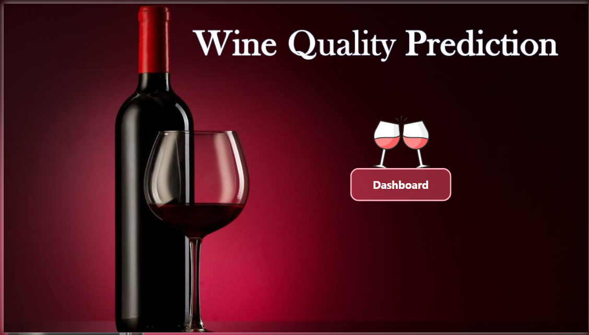
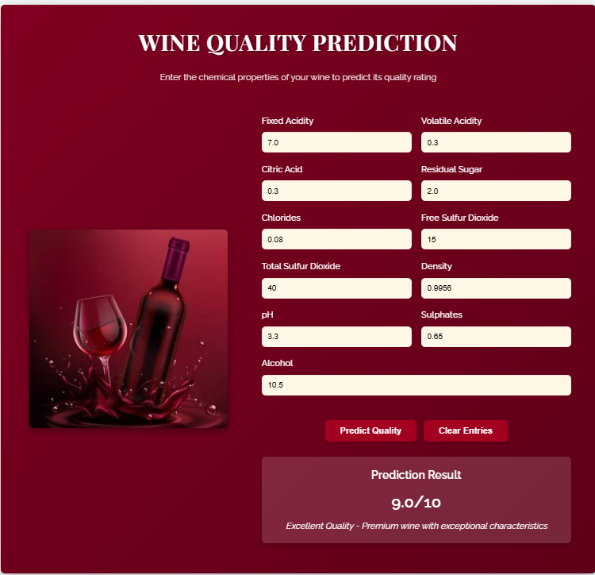

Here’s your **Wine Quality Prediction** project README reformatted in clean, structured Markdown for a GitHub repository:

---

# 🍷 Wine Quality Prediction

## 📌 Project Overview

The **Wine Quality Prediction** project aims to analyze the quality of wine (both red and white) based on its chemical composition using **Machine Learning models**. It includes **data preprocessing, model training, evaluation, and Power BI visualizations**.

### 👨‍💻 Team Members
- **Kirtan Soni** – Enrollment No: `12202040501032` [Github](https://github.com/sonikirtan110/Wine-Quality-Analysis/tree/main)
- **Harry Mehta** – Enrollment No: `12202040501025`

---

## 📂 Folder Structure

```
Wine-Quality-Prediction/
├── Images/                # Power BI & UI screenshots
│   ├── index.png
│   ├── overview.png
│   ├── analysis.png
│   ├── html_ui.png
│
├── data/                  # Datasets (CSV files)
│   ├── wine-quality-white-and-red.csv
│   ├── images.csv
│
├── docs/                  # Project documentation
│   ├── report.pdf
│
├── models/                # Saved ML models
│   ├── wine_quality_pipeline.pkl
│   ├── best_wine_model.pkl
│
├── notebooks/             # Jupyter notebooks
│   ├── WineQuality.ipynb
│
├── src/                   # Source code
│   ├── app.py
│   └── templates/
│       └── index.html
│
├── LICENSE
├── README.md
├── requirements.txt
```

---

## 📊 Dataset Information

- **Source:** [Kaggle - Wine Quality Dataset](https://www.kaggle.com/datasets/ruthgn/wine-quality-data-set-red-white-wine/data)  
- **Description:** Physicochemical test results for red and white wines along with quality ratings.
- **Target Variable:** `quality` (scale: 0–10)
- **Features:**
  - fixed acidity
  - volatile acidity
  - citric acid
  - type
  - residual sugar
  - chlorides
  - free sulfur dioxide
  - total sulfur dioxide
  - density
  - pH
  - sulphates
  - alcohol

---

## ⚙️ Implementation Steps

### 1️⃣ Data Preprocessing
- Handle missing values
- Feature scaling (using `StandardScaler`)
- Train-test split
- Encode the target variable (as a classification problem)

### 2️⃣ Model Training
Five ML models were implemented:
- 🌳 Random Forest  
- 🔍 K-Nearest Neighbors (KNN)  
- 🌿 Decision Tree  
- 📈 Gradient Boosting  
- 🏹 Support Vector Classifier (SVC)

### 3️⃣ Model Evaluation
- Accuracy
- Precision, Recall, F1-Score
- Power BI performance visualizations

### 4️⃣ Power BI Dashboard
- **Index Page:** Dataset summary & wine distribution
- **Overview Page:** Preprocessing steps & feature importance
- **Analysis Page:** Model performance comparison

---

## 🌐 Live Preview

- 🔗 **Power BI Preview:** [View Dashboard](https://app.powerbi.com/view?r=eyJrIjoiOTIwYWYyY2MtOTZiYS00MWUxLWI3NzgtMmFkYTFjMmZmMDZlIiwidCI6ImRhYTU5MmNhLWRlN2ItNGM1NC04ODM2LTkxYTY2OTBmZTE5NyJ9&pageName=dd74d0105ec518cb7330)  
- 🚀 **UI Preview:** [Render App](https://wine-quality-analysis-38rf.onrender.com)

---

## 🖼️ Power BI Dashboard Screenshots

### 🧾 Index Page  


### 🧪 Overview Page  


### 📉 Analysis Page  


### 🌐 HTML UI  


---

## 📋 Dashboard Section Details

### 🏷️ Index Page
- Total wine samples (red/white)
- Quality distribution
- Feature statistics
- Property correlation
- Wine type percentages

### 🔬 Overview Page
- Feature engineering
- Feature importance
- Distribution across quality
- Outlier detection
- Data transformations

### 📊 Analysis Page
- Model comparison (accuracy, precision, recall, F1-score)
- Confusion matrices
- ROC/AUC scores
- Model performance on red vs white wine
- Hyperparameter tuning results

---

## 💻 Source Code

### `src/app.py`
A Flask-based web app for prediction that:
- Loads trained models
- Serves predictions via API
- Accepts red and white wine input
- Returns prediction with confidence
- Includes form UI and validation
- Supports deployment via Gunicorn

---

## 📦 Requirements

All required libraries are listed in `requirements.txt`.

```txt
Flask==2.0.3  
Werkzeug==2.0.3  
gunicorn==20.1.0  
joblib==1.2.0  
numpy==1.23.5  
pandas==1.5.3  
scikit-learn==1.4.2  
matplotlib==3.6.2  
seaborn==0.12.2
```

### ✅ Install via:
```bash
pip install -r requirements.txt
```

---

## 🚀 Deployment Instructions

### Clone the Repo
```bash
git clone https://github.com/<your-username>/Wine-Quality-Prediction.git
cd Wine-Quality-Prediction
```

### Install Dependencies
```bash
pip install -r requirements.txt
```

### Run Locally
```bash
python src/app.py
```

### Run with Gunicorn (for deployment)
```bash
gunicorn --bind 0.0.0.0:$PORT src.app:app
```

---

## 📁 Submission Checklist

1. Push all files to GitHub repo  
2. Write meaningful commit messages  
3. Include `README.md`, `requirements.txt`, and `LICENSE`  
4. Attach Power BI report (PDF or Markdown)  
5. Submit GitHub repo link

---

## 📫 Contact

📧 Email: [mehtaharry39@gmail.com](mailto:mehtaharry39@gmail.com)  
🔗 LinkedIn: [Harry Mehta](https://www.linkedin.com/in/harry-mehta-370963318)

---

## 📜 License

This project is open-source under the **Apache License**.

---

⭐️ *If you found this useful, give it a star on GitHub!* 🚀

---

Let me know if you want this turned into a downloadable `README.md` file or if you want help setting up the GitHub repo!
